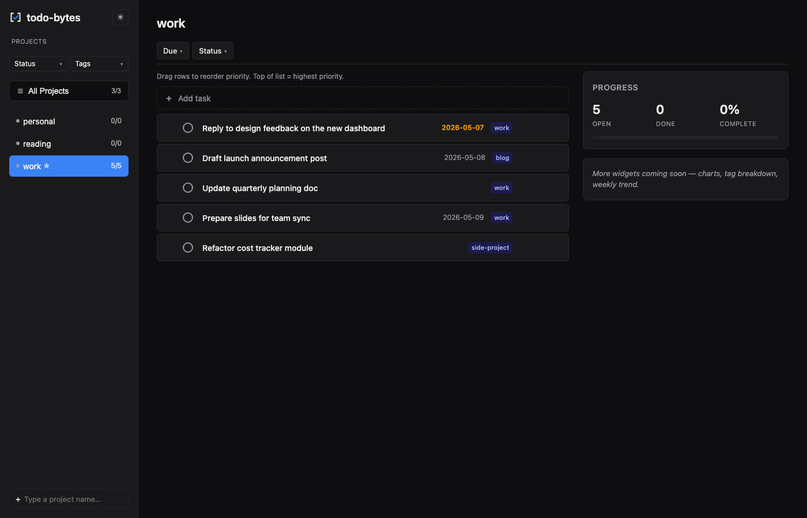

<p align="center">
  
</p>

<p align="center">
  <a href="https://github.com/rishitamrakar/todo-bytes/releases/latest"></a>
  <a href="LICENSE"></a>
</p>

# todo-bytes

A simple todo app. Your tasks live in plain YAML files on your disk. Use the web UI or the `todo` CLI — same data, your choice.

## Install

```bash
brew install uv
uv tool install 'todo-bytes[ui] @ git+https://github.com/rishitamrakar/todo-bytes.git'
```

> Prefer pipx? See [INSTALL.md](INSTALL.md).

## Set up

```bash
todo init
```

It asks where to keep your tasks and the name of your first project. Done.

## Use the web UI

```bash
todo ui
```

Opens `http://127.0.0.1:8765` in your browser.

<p align="center">
  
</p>

## Or use the CLI

```bash
todo add "write blog post" --due tomorrow
todo list                       # open tasks
todo done 1                     # mark done
todo edit 2 --due 2026-08-01
todo rm 2
```

More commands: `todo --help`.

## For AI agents (Pi, Claude Code)

```bash
todo skill install              # installs to ~/.agents/skills/todo-bytes/
```

Your agent can now manage tasks for you using the `todo` CLI.

## Use with Claude Code (MCP)

```bash
uv tool install --force 'todo-bytes[mcp] @ git+https://github.com/rishitamrakar/todo-bytes.git'
claude mcp add todo-bytes -- todo-bytes-mcp
```

Claude Code now has native tools for tasks: `add_task`, `list_tasks`, `mark_done`, `reopen_task`, `update_task`, `delete_task`, `move_task`, `list_projects`, `project_summary`, `show_task`.

Mechanically: the MCP server is a thin shim that invokes the `todo` CLI under the hood. Same code path Pi uses — if a CLI command works in your terminal, it works for Claude too.

## Sync to Google Calendar

```bash
todo sync setup                 # one-time wizard, takes ~1 minute
```

The wizard walks you through three things:

1. Picks where to write your `tasks.ics` (defaults to your Google Drive folder)
2. Tells you exactly how to share the file on Drive and gives you the URL to paste
3. Saves the config so every future task save auto-updates the file

After that, your tasks show up in Google Calendar (and Apple Calendar, or anything that reads iCalendar URLs) with reminders at due times. One-way sync — todo-bytes is the source of truth.

Gotchas worth knowing:
- Needs the **[Google Drive desktop app](https://www.google.com/drive/download/)** installed for the file to actually reach the cloud
- Google Calendar polls subscribed URLs every few hours, so changes aren't real-time — but reminders fire correctly at due times
- To turn it off: `todo sync disable`

## Upgrade

```bash
uv tool upgrade todo-bytes
```

Your tasks and config are never touched.

## More

- **[INSTALL.md](INSTALL.md)** — full install options (uv, pipx, dev), upgrade, uninstall, where files live
- **[docs/DEVELOPER.md](docs/DEVELOPER.md)** — dev setup, design notes, contributing

## License

MIT — see [LICENSE](LICENSE).
